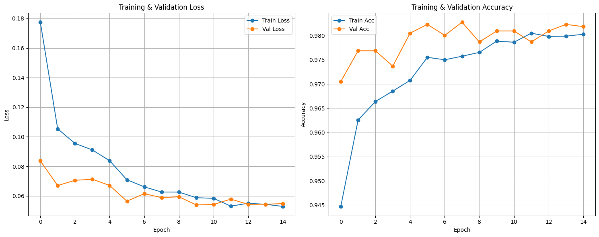
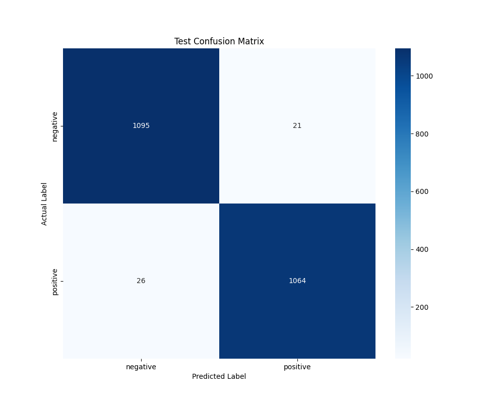
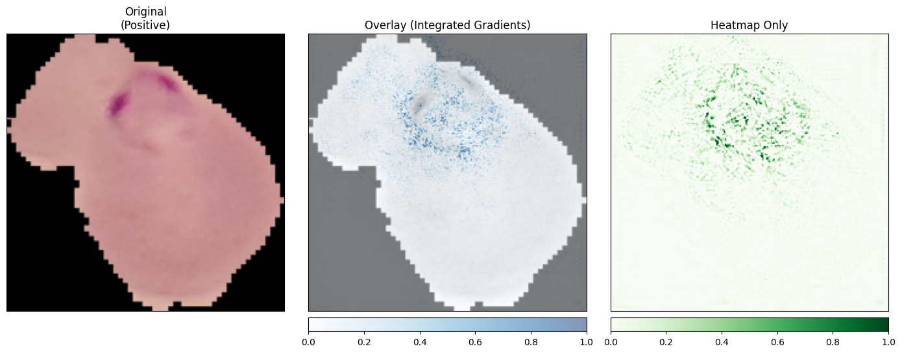

# Project: Neural Classification of Erythrocyte Anomalies

## 1. Project Overview
In low-resource hematology settings, manual screening of blood smears for intracellular parasites is time-consuming and error-prone. This project aims to automate the triage process by developing a Deep Learning model capable of distinguishing between healthy erythrocytes (red blood cells) and those containing a specific **intracellular pathogen**.

**Goal:** Design, train, and validate a **Convolutional Neural Network (CNN)** to perform binary classification on single-cell images.

## 2. The Dataset
**Download Link:** [Dataset](https://chmura.put.poznan.pl/s/azZNaEokFpaNfyt)

The proprietary dataset consists of segmented “patches” (Regions of Interest) extracted from thin blood smear slides stained with Giemsa. Each image contains a single cell.

### Data Structure
The data is split into two sets:
* **`train`** (~22,000 labeled images):
    * **`negative`**: Healthy/Control samples.
    * **`positive`**: Infected/Anomalous samples.
* **`test`** (~5,500 unlabeled images):
    * No ground truth labels provided.
    * Used for generating final predictions for grading.

**Note:** Images have varying resolutions and aspect ratios. A robust pre-processing strategy is required.

## 3. Technical Objectives

### A. Data Pre-processing & Augmentation
Implement a pipeline to:
1.  **Resize/Rescale** images to a fixed input size (e.g., 64x64, 128x128, or 224x224).
2.  **Normalize** pixel intensity values.
3.  Implement **Data Augmentation** on the training set (rotations, flips, brightness) to prevent overfitting.

### B. Neural Network Architecture
Construct a CNN using one of the following paths:
* **Custom Architecture:** Design your own stack of Convolutional, Max-Pooling, and Dense layers. Justify kernel sizes and depth.
* **Transfer Learning:** Use a pre-trained backbone (e.g., VGG-16, ResNet-18, MobileNet) with a custom classification head. Explain freezing/unfreezing strategy.

### C. Training Loop
* **Loss Function:** Select a loss function appropriate for binary classification.
* **Optimizer:** Use an adaptive optimizer or SGD with momentum.
* **Validation:** Create an internal validation split (e.g., 80/20) from the `train` set to monitor loss and prevent overfitting.

## 4. Applied Solution

### 4.1 Neural Network Architecture
The solution is built on **transfer learning**. **EfficientNet_V2_S** is used as the backbone, initialized with weights trained on **IMAGENET1K_V1**, which allows leveraging features extracted from a large visual dataset.

The architecture was adapted to the task by adding a custom **classification head**. The detailed parameters of the best-performing model are as follows:

* **Base model:** EfficientNet_V2_S (IMAGENET1K_V1 weights).
* **Classifier structure (number of hidden layers):** 4 layers (`n_layers`).
* **Hidden layer size:** 128 neurons (`hidden_dim`).
* **Dropout:** Disabled in the final configuration.
* **Input size:** Images rescaled to **224 × 224** pixels.
* **Output layer:** At the end of the network there is a fully connected linear layer that maps the feature vector from the last hidden layer to the output logits for the classes (healthy / infected).

### 4.2 Loss Function and Metrics
Because the problem is **binary**, **cross-entropy** was used as the loss function (**CrossEntropyLoss**). The main metric monitored on the validation set was **validation loss** (`val_loss`), which at the best checkpoint (**epoch 9**) reached **0.05**. **Accuracy** was monitored additionally.

## 5. Training Process

The training workflow was organized with **PyTorch Lightning**, which structured the training and validation loop. The main goal was a model with strong **generalization**, achieved through advanced data processing and hyperparameter optimization.

### 5.1 Training Strategy and Data Augmentation
To reduce **overfitting** and improve robustness, **data augmentation** was central. During training, input images underwent random transformations, which artificially increased training diversity and encouraged the model to learn features invariant to rotation or lighting changes.

The training strategy also included:

* **Transfer learning:** ImageNet pre-trained weights were used as a starting point, which significantly sped up convergence.
* **Fine-tuning:** The entire backbone was **unfrozen** (`freeze_backbone: False`) because of the large training set. This allowed weights in all layers to be updated and the feature extractor to be tuned precisely to malaria blood-cell microscopy images.

### 5.2 Experiment Procedure
To ensure reliable results, the following procedures were used:

* **Data split:** The dataset was divided into three disjoint subsets: **80%** training (weight updates), **10%** validation (hyperparameter tuning and early stopping), and **10%** test. This separation enabled an objective evaluation on data not seen during training.
* **Monitoring:** **Weights & Biases (WandB)** was used to track experiments and log results in real time.
* **Checkpointing:** Model weights were saved with **model checkpointing** based on the best validation loss. The final selected model comes from **epoch 9** of training.

### 5.3 Training Hyperparameters
Hyperparameters used during the training loop:

| Parameter | Value |
|-----------|-------|
| Number of epochs | 50 |
| Batch size | 32 |
| Learning rate | 9.0 × 10⁻⁵ |
| Weight decay | 2.3 × 10⁻⁵ |
| Optimizer | Adam |
| Early stopping patience | 5 epochs |
| Seed | 42 |

**Table 1:** Summary of training hyperparameters.

### 5.4 Results and Plots
Below are the training curves and the final evaluation of the best model obtained.

**Figure 1:** Training and validation **loss** and **accuracy** curves.

**Figure 2:** **Confusion matrix** on the held-out test set.

**Table 2:** Evaluation results on the held-out test set

| Metric | Result |
|--------|--------|
| Accuracy | 0.97869 |
| Precision | 0.97873 |
| Recall | 0.97866 |
| F1-Score | 0.97869 |

## 6. Model Interpretability Analysis (XAI)

To make the neural network’s decisions more transparent (the so-called “black box”), **Explainable AI (XAI)** methods were implemented using the **Captum** library.

### 6.1 Method: Integrated Gradients
The main attribution method chosen was **Integrated Gradients**. This method allows:

1. Computing the influence of each input image pixel on the final model prediction.
2. Generating **saliency maps** that visualize regions of the cell the network focuses on (e.g., presence of the parasite inside the erythrocyte).

An analytical script in the notebook (Google Colab) visualizes results in three variants: original image, attribution map overlaid (**heatmap overlay**), and the heatmap alone. This supports checking whether the model learns correct morphological features or relies on background artifacts.

**Figure 3:** Result of the Integrated Gradients method.

## 7. Summary

The developed solution combines modern deep learning (**transfer learning**, **PyTorch Lightning**) with interpretability analysis (**Captum**). The low validation loss (**0.05**) suggests strong performance on malaria infection classification.

Interpretability analysis yielded important conclusions:

* **Decision correctness:** Attribution maps showed that for **“positive”** samples the neural network focuses most on dark inclusions inside erythrocytes that correspond to the actual parasite location.
* **Artifact reduction:** The analysis confirmed that the model ignores background noise and irrelevant cell-shape cues, which indicates it did **not** learn spurious correlations (so-called **shortcut learning**).

The project demonstrates that the model does not behave as a pure “black box”; its predictions rely on biologically plausible morphological features, which is essential for systems that support medical diagnosis.
